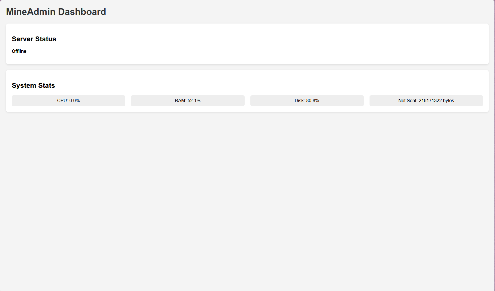
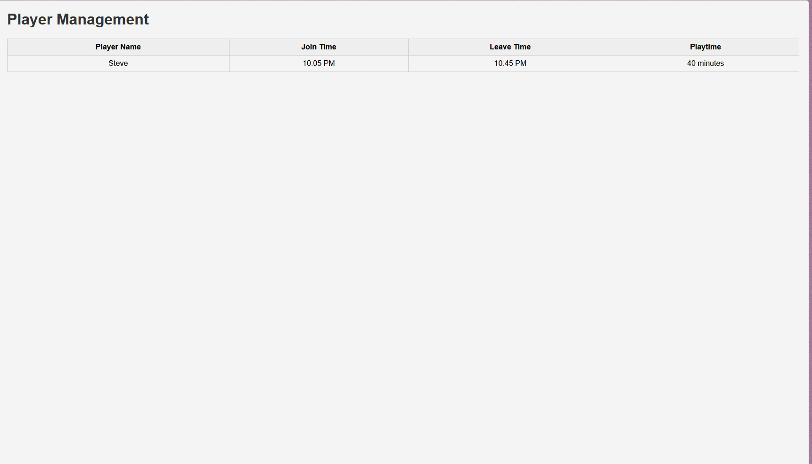
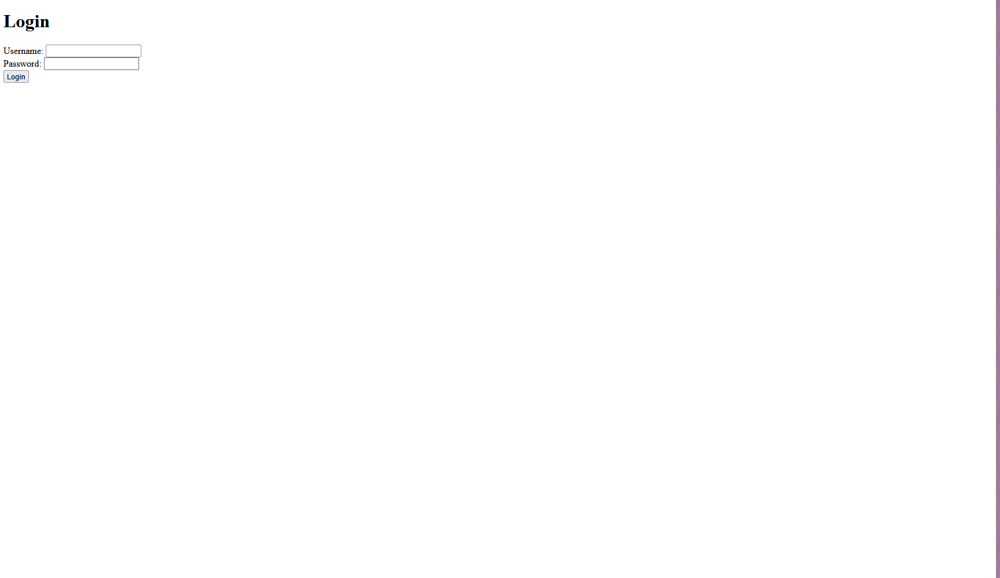
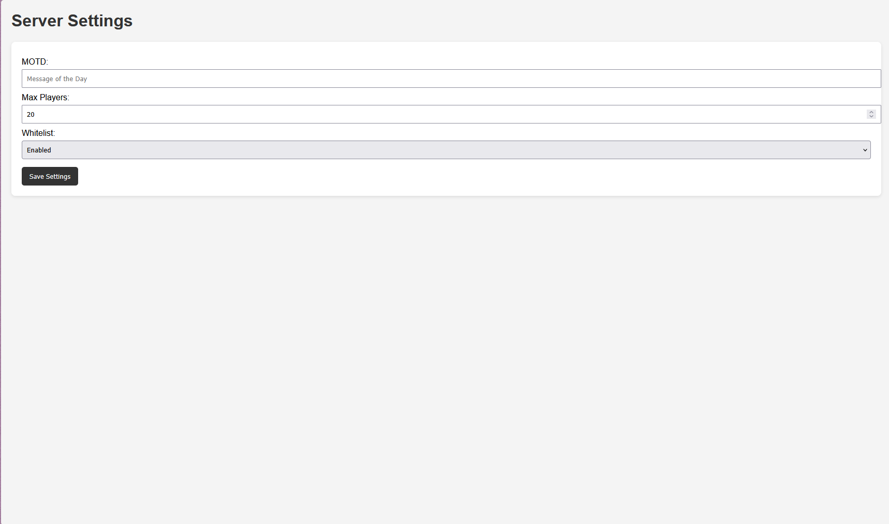

# MineAdmin Dashboard

A modern web dashboard to monitor and manage Minecraft servers remotely.

---
## 📖 Overview
MineAdmin Dashboard is a lightweight web application designed for Minecraft server administrators.  
It provides real‑time insights into server performance, player activity, and system health — all from a clean, modern interface.  
The goal is to simplify server management by combining monitoring, control, and notifications in one place.

---

## 🔑 Key Features
- **Live Server Status**  
  Instantly see whether your server is online, how many players are connected, and the current MOTD.  
  Useful for admins who need quick visibility without logging into the console.

- **Player Management**  
  Track join/leave times, playtime, and maintain a history of player activity.  
  This helps in moderating communities and identifying active players.

- **Remote Console**  
  Send commands directly to the server from the dashboard.  
  No need to SSH into the host — everything is accessible via the web.

- **Discord Webhooks**  
  Get automated alerts in your Discord server when players join, leave, or when performance thresholds are exceeded.  
  Keeps your community engaged and informed.

- **System Monitoring**  
  CPU, RAM, Disk, and Network usage are displayed in real time.  
  Prevent crashes by spotting resource bottlenecks early.

---

## 🎯 Use Cases
- Running community servers and needing quick player insights.  
- Hosting events where uptime and performance monitoring are critical.  
- Automating alerts to Discord so admins don’t miss important changes.  
- Providing a professional dashboard for recruiters to showcase full‑stack skills.

---

## 📸 Screenshots

  
  

  
  

